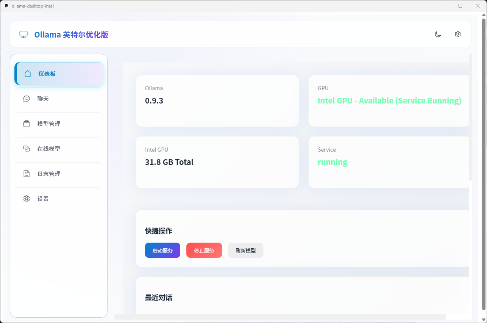
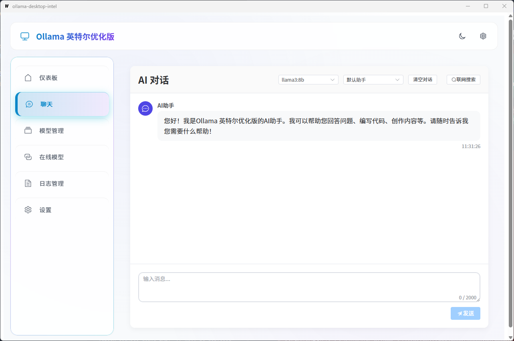
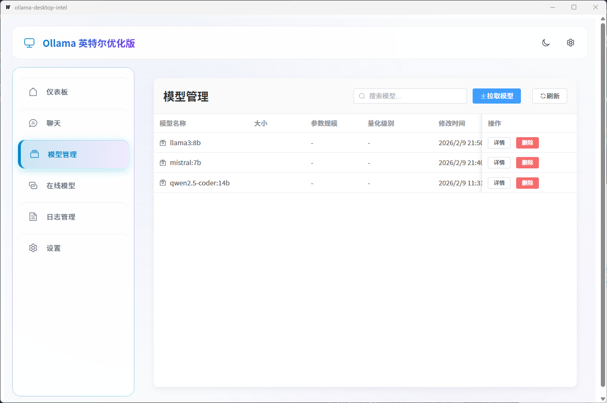
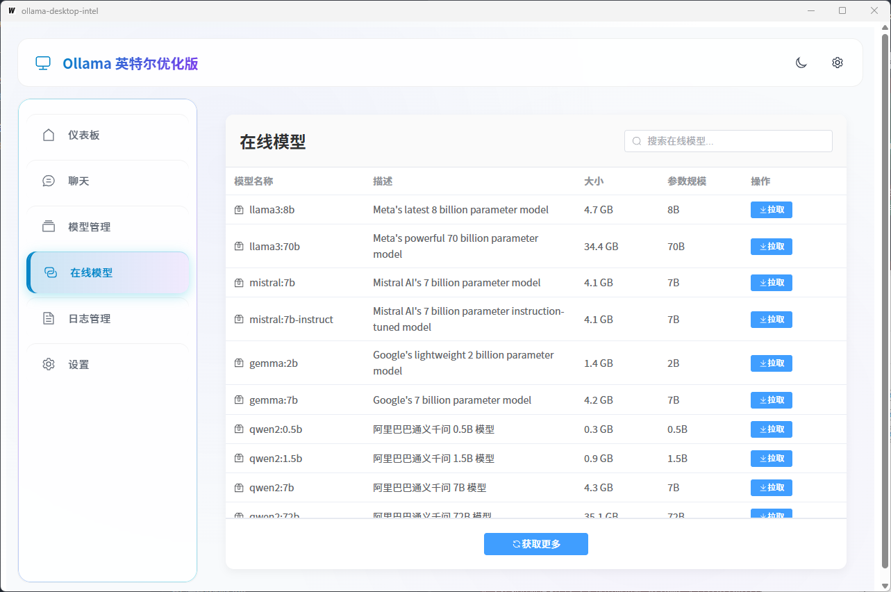
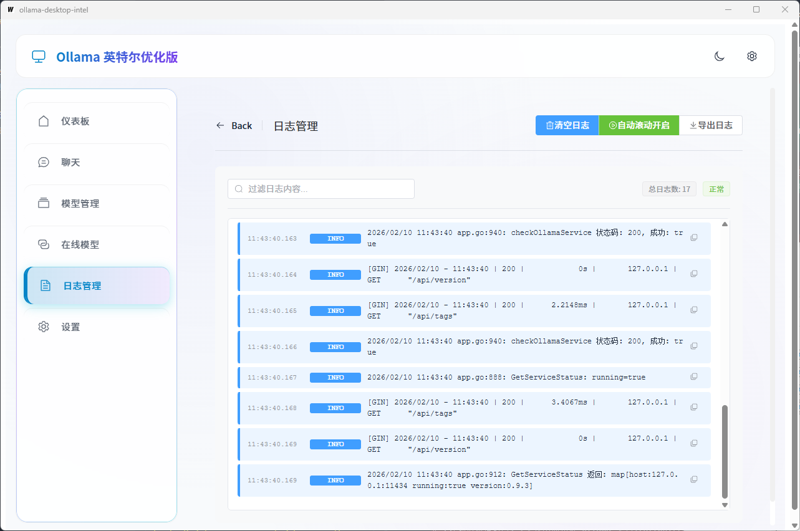
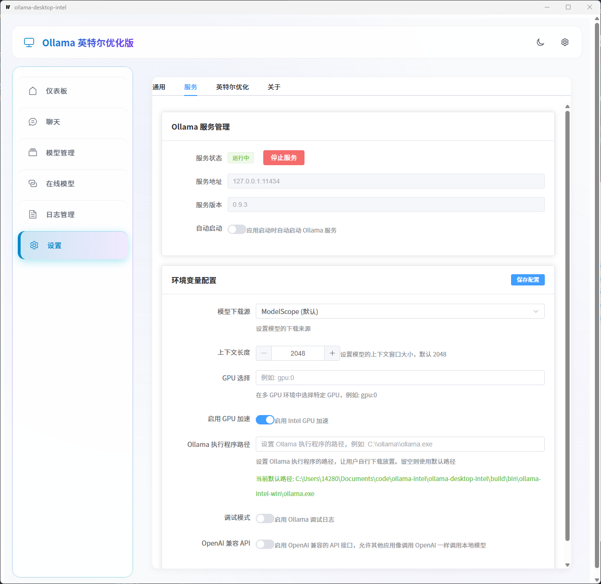
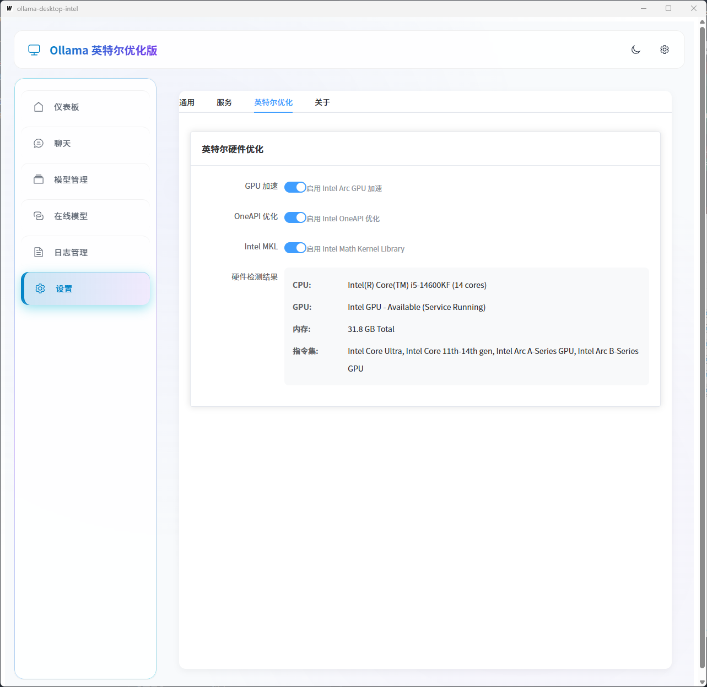

# Ollama 英特尔优化版

## 项目简介
Ollama 英特尔优化版是一个专为英特尔硬件优化的桌面应用解决方案，用于在 Windows、macOS 和 Linux 操作系统上运行和管理 Ollama 模型的 GUI 工具。

该版本特别针对英特尔处理器、Intel Arc GPU 和相关技术栈进行了深度优化，提供最佳性能体验。

## 功能特性

### 核心功能
- **AI 聊天**：支持与本地 Ollama 模型进行对话，提供实时流式响应
- **模型管理**：查看、拉取、删除本地模型
- **在线模型**：浏览和搜索可用的在线模型，支持分页加载
- **仪表盘**：实时监控系统状态、模型使用情况和服务状态
- **日志管理**：查看、过滤、导出应用日志
- **设置管理**：配置服务参数、环境变量和英特尔硬件优化选项
- **OpenAI 兼容 API**：提供与 OpenAI API 兼容的接口，让本地模型可以被其他应用标准化调用

### 英特尔优化亮点
- **GPU 加速**：充分利用 Intel Arc GPU 进行模型推理加速
- **OneAPI 优化**：集成英特尔 OneAPI 技术栈，提升性能
- **MKL 支持**：使用 Intel Math Kernel Library 优化数学计算
- **硬件检测**：自动检测并适配英特尔硬件特性

### 技术亮点
- **WebSocket 流式响应**：提供实时、流畅的对话体验
- **玻璃态 UI 设计**：现代化的玻璃态界面，带有霓虹效果
- **暗色/亮色主题**：支持一键切换主题模式
- **响应式布局**：适配不同屏幕尺寸
- **组件化架构**：模块化设计，易于维护和扩展

## 界面展示

### 仪表盘


### 聊天界面


### 模型管理


### 在线模型


### 日志管理


### 设置界面


### 服务状态


## 系统要求

### 硬件要求
- **CPU**：英特尔处理器（推荐第 10 代或更高）
- **GPU**：Intel Arc GPU（可选，用于加速）
- **内存**：至少 8GB RAM（推荐 16GB 或更高）
- **存储**：至少 20GB 可用空间

### 软件要求
- **操作系统**：Windows 10/11、Linux（Ubuntu 20.04+）
- **Ollama**：v0.9.0 或更高版本
- **网络**：拉取模型时需要互联网连接

> **注意**：当前版本暂不支持 macOS 平台，仅支持 Windows 和 Linux 系统。

## 快速开始

### 安装
1. 从 [GitHub Releases](https://github.com/kingoflongevity/ollama-intel-go/releases) 或 [Gitee 发行版](https://gitee.com/LangHuaHuachihua/ollama-intel-go/releases) 下载对应平台的安装包
2. 运行安装程序并按照提示完成安装
3. 启动应用程序

### 首次使用
1. 确保 Ollama 服务已启动
2. 在应用程序中点击「模型管理」页面
3. 点击「拉取模型」按钮，输入模型名称（如 `llama3:8b`）
4. 等待模型拉取完成
5. 切换到「聊天」页面，开始与模型对话

## OpenAI 兼容 API 使用指南

### 概述
Ollama 英特尔优化版提供了与 OpenAI API 兼容的接口，允许其他应用像调用 OpenAI 一样调用本地模型。

### API 端点

Ollama 服务默认在 `11434` 端口上提供 OpenAI 兼容的 API 端点：

| 端点 | 方法 | 描述 |
|------|------|------|
| `/v1/models` | GET | 获取可用模型列表 |
| `/v1/models/{model}` | GET | 获取特定模型的详细信息 |
| `/v1/chat/completions` | POST | 创建聊天完成 |
| `/v1/completions` | POST | 创建文本完成 |
| `/v1/embeddings` | POST | 创建文本嵌入 |

### 配置

在应用程序的「设置」页面中，可以配置 OpenAI 兼容 API 的相关选项：

- **启用 OpenAI 兼容 API**：开启或关闭该功能
- **API 密钥**：设置用于验证 API 调用的密钥（可选）
- **API 端口**：设置 API 服务的端口（默认 8080）

### 使用示例

#### Python 示例

```python
import openai

# 配置客户端
openai.api_key = "your-api-key"  # 可选，如果设置了
openai.api_base = "http://localhost:11434/v1"  # Ollama 服务的 API 基础 URL

# 发送聊天请求
response = openai.ChatCompletion.create(
    model="llama3:8b",
    messages=[
        {"role": "system", "content": "You are a helpful assistant."},
        {"role": "user", "content": "Hello! How are you?"}
    ],
    stream=True  # 启用流式响应
)

# 处理流式响应
for chunk in response:
    if "content" in chunk.choices[0].delta:
        print(chunk.choices[0].delta.content, end="")
```

#### curl 示例

```bash
# 获取模型列表
curl http://localhost:11434/v1/models

# 发送聊天请求
curl -X POST http://localhost:11434/v1/chat/completions \
  -H "Content-Type: application/json" \
  -d '{
    "model": "llama3:8b",
    "messages": [
      {"role": "system", "content": "You are a helpful assistant."},
      {"role": "user", "content": "Hello! How are you?"}
    ],
    "stream": true
  }'
```

### 第三方应用集成

由于提供了标准的 OpenAI 兼容 API，您可以将本地模型集成到各种支持 OpenAI API 的应用中，例如：

- **AutoGPT**：使用本地模型运行自主代理
- **LangChain**：构建基于本地模型的应用链
- **ChatGPT 客户端**：使用本地模型替代 OpenAI API
- **各种 AI 工具**：任何支持 OpenAI API 的工具

只需将应用中的 API 基础 URL 设置为 `http://localhost:11434/v1` 即可。

## 技术架构

### 后端
- **语言**：Go
- **框架**：Wails
- **WebSocket**：Gorilla WebSocket
- **Ollama API**：与 Ollama 服务交互

### 前端
- **框架**：Vue 3 + Composition API
- **UI 库**：Element Plus
- **构建工具**：Vite
- **路由**：Vue Router

## 开发指南

### 环境搭建
1. 安装 Go 1.20+ 和 Node.js 18+
2. 安装 Wails CLI：`go install github.com/wailsapp/wails/v2/cmd/wails@latest`
3. 克隆仓库：`git clone https://github.com/kingoflongevity/ollama-intel-go.git`
4. 进入项目目录：`cd ollama-intel-go`
5. 安装依赖：`npm install`（前端）和 `go mod tidy`（后端）

### 运行开发服务器
```bash
wails dev
```

### 构建应用
```bash
# Windows
./build-windows.bat

# Linux
./build-linux.sh
```

## 贡献指南

欢迎通过以下方式贡献项目：
1. 提交 Issue 报告 bug 或提出新功能建议
2. 提交 Pull Request 修复 bug 或实现新功能
3. 改进文档和翻译
4. 分享使用经验和优化建议

## 许可证

本项目采用 MIT 许可证。

## 联系方式

- **GitHub**：[kingoflongevity/ollama-intel-go](https://github.com/kingoflongevity/ollama-intel-go)
- **Gitee**：[LangHuaHuachihua/ollama-intel-go](https://gitee.com/LangHuaHuachihua/ollama-intel-go)

---

# Ollama Intel Optimized Version

## Project Introduction
Ollama Intel Optimized Version is a desktop application solution specifically optimized for Intel hardware, designed to run and manage Ollama models on Windows, macOS, and Linux operating systems with a GUI tool.

This version is specially optimized for Intel processors, Intel Arc GPU, and related technology stacks to provide the best performance experience.

## Features

### Core Features
- **AI Chat**：Supports conversations with local Ollama models, providing real-time streaming responses
- **Model Management**：View, pull, and delete local models
- **Online Models**：Browse and search available online models, supporting pagination
- **Dashboard**：Real-time monitoring of system status, model usage, and service status
- **Log Management**：View, filter, and export application logs
- **Settings Management**：Configure service parameters, environment variables, and Intel hardware optimization options
- **OpenAI Compatible API**：Provides an interface compatible with OpenAI API, allowing local models to be called by other applications in a standardized way

### Intel Optimization Highlights
- **GPU Acceleration**：Fully utilize Intel Arc GPU for model inference acceleration
- **OneAPI Optimization**：Integrate Intel OneAPI technology stack to improve performance
- **MKL Support**：Use Intel Math Kernel Library to optimize mathematical calculations
- **Hardware Detection**：Automatically detect and adapt to Intel hardware features

### Technical Highlights
- **WebSocket Streaming**：Provide real-time, smooth conversation experience
- **Glass Morphism UI**：Modern glass-like interface with neon effects
- **Dark/Light Theme**：Support one-click theme switching
- **Responsive Layout**：Adapt to different screen sizes
- **Component-based Architecture**：Modular design for easy maintenance and extension

## Interface Showcase

### Dashboard


### Chat Interface


### Model Management


### Online Models


### Log Management


### Settings Interface


### Service Status


## System Requirements

### Hardware Requirements
- **CPU**：Intel processor (10th generation or higher recommended)
- **GPU**：Intel Arc GPU (optional, for acceleration)
- **Memory**：At least 8GB RAM (16GB or higher recommended)
- **Storage**：At least 20GB available space

### Software Requirements
- **Operating System**：Windows 10/11, Linux (Ubuntu 20.04+)
- **Ollama**：v0.9.0 or higher
- **Network**：Internet connection required for pulling models

> **Note**：macOS platform is not supported in the current version, only Windows and Linux systems are supported.

## Quick Start

### Installation
1. Download the installation package for your platform from [GitHub Releases](https://github.com/kingoflongevity/ollama-intel-go/releases) or [Gitee Releases](https://gitee.com/LangHuaHuachihua/ollama-intel-go/releases)
2. Run the installer and follow the instructions to complete the installation
3. Launch the application

### First Use
1. Ensure Ollama service is started
2. Click on the "Model Management" page in the application
3. Click the "Pull Model" button and enter the model name (e.g., `llama3:8b`)
4. Wait for the model to be pulled
5. Switch to the "Chat" page and start chatting with the model

## OpenAI Compatible API Guide

### Overview
Ollama Intel Optimized Version provides an interface compatible with OpenAI API, allowing other applications to call local models as if they were calling OpenAI.

### API Endpoints

Ollama service by default provides OpenAI compatible API endpoints on port `11434`:

| Endpoint | Method | Description |
|----------|--------|-------------|
| `/v1/models` | GET | Get available models list |
| `/v1/models/{model}` | GET | Get detailed information about a specific model |
| `/v1/chat/completions` | POST | Create chat completion |
| `/v1/completions` | POST | Create text completion |
| `/v1/embeddings` | POST | Create text embeddings |

### Configuration

In the "Settings" page of the application, you can configure OpenAI compatible API related options:

- **Enable OpenAI Compatible API**: Turn this feature on or off
- **API Key**: Set the key used to authenticate API calls (optional)
- **API Port**: Set the port for the API service (default 8080)

### Usage Examples

#### Python Example

```python
import openai

# Configure client
openai.api_key = "your-api-key"  # Optional, if set
openai.api_base = "http://localhost:11434/v1"  # Ollama service API base URL

# Send chat request
response = openai.ChatCompletion.create(
    model="llama3:8b",
    messages=[
        {"role": "system", "content": "You are a helpful assistant."},
        {"role": "user", "content": "Hello! How are you?"}
    ],
    stream=True  # Enable streaming response
)

# Handle streaming response
for chunk in response:
    if "content" in chunk.choices[0].delta:
        print(chunk.choices[0].delta.content, end="")
```

#### curl Example

```bash
# Get models list
curl http://localhost:11434/v1/models

# Send chat request
curl -X POST http://localhost:11434/v1/chat/completions \
  -H "Content-Type: application/json" \
  -d '{
    "model": "llama3:8b",
    "messages": [
      {"role": "system", "content": "You are a helpful assistant."},
      {"role": "user", "content": "Hello! How are you?"}
    ],
    "stream": true
  }'
```

### Third-party Application Integration

With the standard OpenAI compatible API, you can integrate local models into various applications that support OpenAI API, such as:

- **AutoGPT**: Run autonomous agents with local models
- **LangChain**: Build application chains based on local models
- **ChatGPT Clients**: Use local models as alternatives to OpenAI API
- **Various AI Tools**: Any tool that supports OpenAI API

Simply set the API base URL in your application to `http://localhost:11434/v1`.

## Technical Architecture

### Backend
- **Language**：Go
- **Framework**：Wails
- **WebSocket**：Gorilla WebSocket
- **Ollama API**：Interact with Ollama service

### Frontend
- **Framework**：Vue 3 + Composition API
- **UI Library**：Element Plus
- **Build Tool**：Vite
- **Routing**：Vue Router

## Development Guide

### Environment Setup
1. Install Go 1.20+ and Node.js 18+
2. Install Wails CLI：`go install github.com/wailsapp/wails/v2/cmd/wails@latest`
3. Clone the repository：`git clone https://github.com/kingoflongevity/ollama-intel-go.git`
4. Enter the project directory：`cd ollama-intel-go`
5. Install dependencies：`npm install` (frontend) and `go mod tidy` (backend)

### Run Development Server
```bash
wails dev
```

### Build Application
```bash
# Windows
./build-windows.bat

# Linux
./build-linux.sh
```

## Contribution Guide

Welcome to contribute to the project in the following ways：
1. Submit Issue to report bugs or suggest new features
2. Submit Pull Request to fix bugs or implement new features
3. Improve documentation and translations
4. Share usage experience and optimization suggestions

## License

This project is licensed under the MIT License.

## Contact

- **GitHub**：[kingoflongevity/ollama-intel-go](https://github.com/kingoflongevity/ollama-intel-go)
- **Gitee**：[LangHuaHuachihua/ollama-intel-go](https://gitee.com/LangHuaHuachihua/ollama-intel-go)