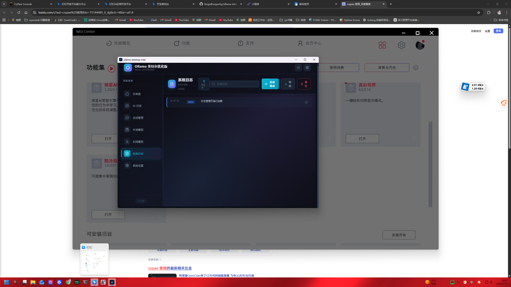
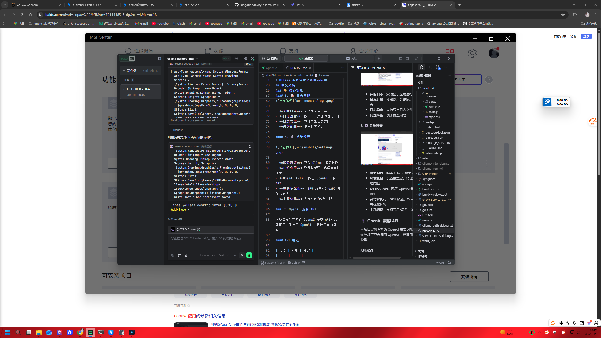
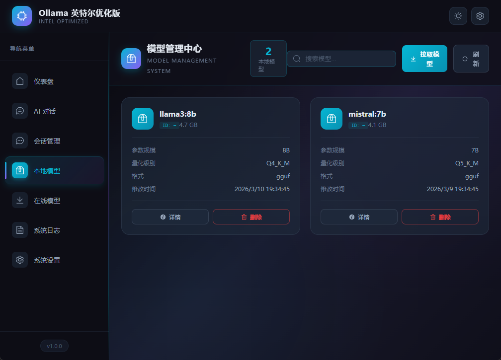
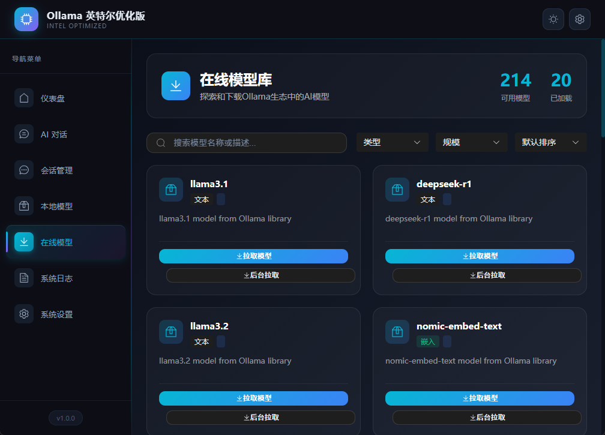
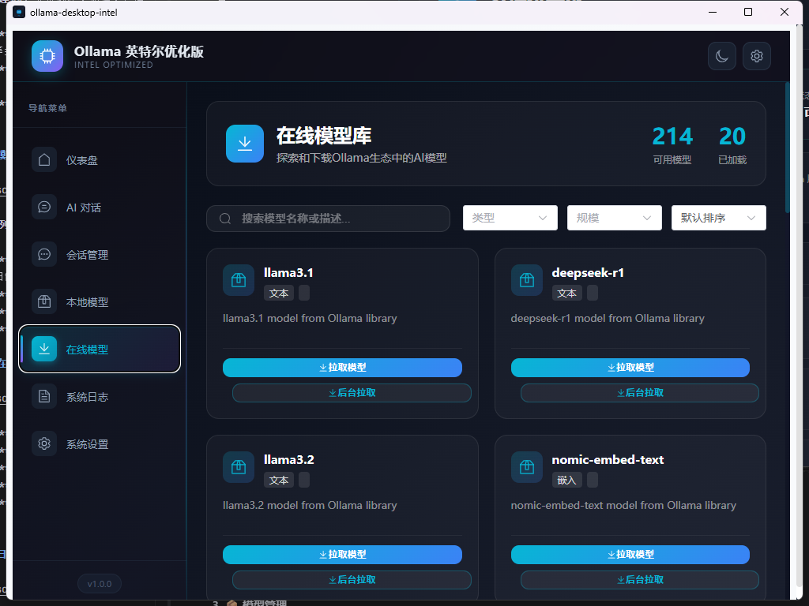
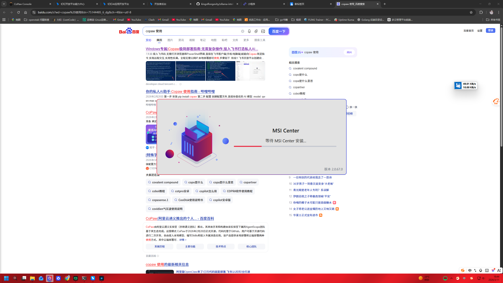

# Ollama 英特尔优化版桌面应用

<div align="center">


**专为英特尔硬件优化的本地 AI 模型管理桌面应用**

[](https://golang.org/)
[](https://vuejs.org/)
[](https://wails.io/)
[](LICENSE)

[English](#english) | [中文文档](#中文文档)

</div>

---

## 中文文档

### 📖 项目简介

Ollama 英特尔优化版是一个专为英特尔硬件优化的桌面应用解决方案，用于在 Windows 和 Linux 操作系统上运行和管理 Ollama 模型。该版本特别针对英特尔处理器、Intel Arc GPU 和相关技术栈进行了深度优化，提供最佳性能体验。

### ✨ 核心功能

#### 1. 📊 系统仪表盘



- **实时监控**：CPU、内存、GPU 使用率实时显示
- **服务状态**：Ollama 服务运行状态一目了然
- **模型统计**：已安装模型数量、总大小统计
- **快捷操作**：常用功能快速入口

#### 2. 🤖 AI 智能对话



- **流式响应**：实时显示 AI 生成内容，无需等待完整响应
- **多会话管理**：支持创建、切换、管理多个对话会话
- **角色预设**：内置代码专家、写作专家、商业顾问等多种角色
- **模型选择**：快速切换不同模型进行对话
- **历史记录**：自动保存对话历史，支持断点续聊

#### 3. 📦 模型管理



- **本地模型列表**：查看已下载的所有模型
- **模型详情**：显示模型大小、参数量、量化级别等详细信息
- **模型操作**：支持删除、复制模型
- **快速拉取**：输入模型名称即可下载
- **进度显示**：实时显示模型下载进度

#### 4. 🌐 在线模型库



- **模型发现**：浏览 Ollama 官方模型库
- **分类浏览**：按类别筛选模型
- **搜索功能**：快速搜索所需模型
- **一键拉取**：点击即可下载模型到本地
- **后台下载**：支持后台拉取，不阻塞界面

#### 5. 📝 日志管理



- **实时日志**：实时显示应用运行日志
- **日志过滤**：按级别、关键词过滤日志
- **日志导出**：支持导出日志文件
- **问题诊断**：便于排查问题

#### 6. ⚙️ 系统设置



- **服务配置**：配置 Ollama 服务参数
- **环境变量**：设置模型源、代理等环境变量
- **OpenAI API**：配置 OpenAI 兼容 API
- **英特尔优化**：GPU 加速、OneAPI 等优化选项
- **主题切换**：支持亮色/暗色主题

### 🔌 OpenAI 兼容 API

本项目提供完整的 OpenAI 兼容 API，允许外部工具像调用 OpenAI 一样调用本地模型。

#### API 端点

| 端点 | 方法 | 描述 |
|------|------|------|
| `http://localhost:11435/v1/models` | GET | 获取可用模型列表 |
| `http://localhost:11435/v1/models/{model}` | GET | 获取特定模型信息 |
| `http://localhost:11435/v1/chat/completions` | POST | 创建聊天完成 |

#### 使用示例

**Python 示例：**

```python
import openai

# 配置客户端
openai.api_key = "ollama"  # 可选
openai.api_base = "http://localhost:11435/v1"

# 发送聊天请求
response = openai.ChatCompletion.create(
    model="llama3:8b",
    messages=[
        {"role": "user", "content": "你好！"}
    ],
    stream=True
)

# 处理流式响应
for chunk in response:
    if chunk.choices[0].delta.get("content"):
        print(chunk.choices[0].delta.content, end="")
```

**curl 示例：**

```bash
# 获取模型列表
curl http://localhost:11435/v1/models

# 发送聊天请求
curl -X POST http://localhost:11435/v1/chat/completions \
  -H "Content-Type: application/json" \
  -d '{
    "model": "llama3:8b",
    "messages": [{"role": "user", "content": "你好！"}],
    "stream": true
  }'
```

### 🚀 快速开始

#### 系统要求

- **操作系统**：Windows 10/11、Linux (Ubuntu 20.04+)
- **CPU**：英特尔处理器（推荐第 10 代或更高）
- **GPU**：Intel Arc GPU（可选，用于加速）
- **内存**：至少 8GB RAM（推荐 16GB 或更高）
- **存储**：至少 20GB 可用空间

#### 安装步骤

1. 从 [GitHub Releases](https://github.com/kingoflongevity/ollama-intel-go/releases) 下载安装包
2. 运行安装程序完成安装
3. 启动应用程序
4. 在「模型管理」页面拉取模型
5. 开始对话！

### 🛠️ 技术架构

#### 后端技术栈

- **语言**：Go 1.21+
- **框架**：Wails v2
- **WebSocket**：Gorilla WebSocket
- **HTTP 服务**：net/http

#### 前端技术栈

- **框架**：Vue 3 + Composition API
- **UI 库**：Element Plus
- **构建工具**：Vite
- **路由**：Vue Router
- **状态管理**：Pinia

### 📋 开发指南

```bash
# 克隆仓库
git clone https://github.com/kingoflongevity/ollama-intel-go.git
cd ollama-intel-go

# 安装依赖
go mod tidy
cd frontend && npm install

# 开发模式运行
wails dev

# 构建应用
wails build
```

---

## 🗺️ 开发路线图

### v1.0（当前版本）

- [x] AI 智能对话（流式响应）
- [x] 模型管理（拉取、删除、查看）
- [x] 在线模型库浏览
- [x] 系统仪表盘
- [x] OpenAI 兼容 API
- [x] 日志管理
- [x] 多会话管理
- [x] 模型拉取进度显示
- [x] 专业应用图标

### v1.1（下一版本 - 规划中）

#### 🌐 模型联网功能

计划实现模型联网搜索能力，让 AI 能够获取实时信息：

**功能特性：**
- **搜索引擎集成**：支持 DuckDuckGo、Google、Bing 等搜索引擎
- **网页内容提取**：自动提取网页关键信息
- **智能搜索**：AI 自动判断是否需要联网搜索
- **来源引用**：在回答中标注信息来源

**技术方案：**
```
用户提问 → AI判断是否需要联网 → 搜索引擎查询 → 内容提取 → AI整合回答
```

**实现架构：**
```
┌─────────────────────────────────────────────────────┐
│                    用户提问                          │
└─────────────────────┬───────────────────────────────┘
                      │
┌─────────────────────▼───────────────────────────────┐
│              AI 意图分析模块                         │
│  - 判断是否需要联网搜索                              │
│  - 提取搜索关键词                                    │
│  - 确定搜索策略                                      │
└─────────────────────┬───────────────────────────────┘
                      │
┌─────────────────────▼───────────────────────────────┐
│              搜索引擎接口层                          │
│  - DuckDuckGo API                                   │
│  - Google Custom Search API                         │
│  - Bing Search API                                  │
└─────────────────────┬───────────────────────────────┘
                      │
┌─────────────────────▼───────────────────────────────┐
│              内容提取与处理                          │
│  - 网页内容抓取                                      │
│  - 文本清洗与提取                                    │
│  - 关键信息摘要                                      │
└─────────────────────┬───────────────────────────────┘
                      │
┌─────────────────────▼───────────────────────────────┐
│              AI 整合回答                             │
│  - 结合搜索结果生成回答                              │
│  - 添加来源引用                                      │
│  - 格式化输出                                        │
└─────────────────────────────────────────────────────┘
```

#### 🤖 Agent 智能代理

计划实现多 Agent 协作系统：

**功能特性：**
- **任务分解**：将复杂任务自动分解为子任务
- **多 Agent 协作**：不同 Agent 负责不同任务
- **工具调用**：Agent 可调用外部工具（代码执行、文件操作等）
- **记忆系统**：长期记忆和短期记忆支持

**Agent 架构设计：**
```
┌─────────────────────────────────────────────────────┐
│                    用户请求                          │
└─────────────────────┬───────────────────────────────┘
                      │
┌─────────────────────▼───────────────────────────────┐
│              主控 Agent (Orchestrator)               │
│  - 任务理解与分解                                    │
│  - Agent 调度与协调                                  │
│  - 结果整合与输出                                    │
└─────────────────────┬───────────────────────────────┘
                      │
        ┌─────────────┼─────────────┐
        │             │             │
┌───────▼───────┐ ┌───▼───────┐ ┌───▼───────┐
│  搜索 Agent   │ │ 代码 Agent │ │ 写作 Agent │
│              │ │           │ │           │
│ - 网络搜索   │ │ - 代码生成 │ │ - 文案撰写 │
│ - 信息提取   │ │ - 代码执行 │ │ - 内容润色 │
│ - 数据收集   │ │ - 调试修复 │ │ - 翻译校对 │
└───────┬───────┘ └─────┬─────┘ └─────┬─────┘
        │               │             │
        └───────────────┼─────────────┘
                        │
┌───────────────────────▼─────────────────────────────┐
│              工具层 (Tools)                          │
│  - 搜索引擎 API    - 代码执行器    - 文件操作       │
│  - 数据库查询      - HTTP 请求     - 图像处理       │
└─────────────────────────────────────────────────────┘
```

**Agent 类型规划：**

| Agent 类型 | 职责 | 工具能力 |
|-----------|------|---------|
| 搜索 Agent | 信息检索、数据收集 | 搜索引擎、网页抓取 |
| 代码 Agent | 代码生成、执行、调试 | 代码执行器、文件操作 |
| 写作 Agent | 内容创作、翻译、润色 | 文本处理、格式转换 |
| 分析 Agent | 数据分析、图表生成 | 数据处理、可视化 |
| 规划 Agent | 任务规划、时间管理 | 日历、提醒 |

### v1.2+（未来规划）

- [ ] 多模态支持（图片、音频）
- [ ] 知识库管理（RAG）
- [ ] 模型微调界面
- [ ] 分布式推理支持
- [ ] 插件系统
- [ ] 语音交互
- [ ] 多语言支持

---

## 🤝 贡献指南

欢迎参与项目贡献！

1. Fork 本仓库
2. 创建特性分支 (`git checkout -b feature/AmazingFeature`)
3. 提交更改 (`git commit -m 'Add some AmazingFeature'`)
4. 推送到分支 (`git push origin feature/AmazingFeature`)
5. 提交 Pull Request

---

## 📄 许可证

本项目采用 MIT 许可证 - 详见 [LICENSE](LICENSE) 文件

---

## 📞 联系方式

- **GitHub**: [kingoflongevity/ollama-intel-go](https://github.com/kingoflongevity/ollama-intel-go)
- **Gitee**: [LangHuaHuachihua/ollama-intel-go](https://gitee.com/LangHuaHuachihua/ollama-intel-go)
- **问题反馈**: [GitHub Issues](https://github.com/kingoflongevity/ollama-intel-go/issues)

---

<div align="center">

**如果这个项目对您有帮助，请给一个 ⭐️ Star 支持一下！**

Made with ❤️ by Ollama Intel Team

</div>

---

# English

## 📖 Project Introduction

Ollama Intel Optimized Version is a desktop application solution specifically optimized for Intel hardware, designed to run and manage Ollama models on Windows and Linux operating systems. This version is specially optimized for Intel processors, Intel Arc GPU, and related technology stacks to provide the best performance experience.

## ✨ Core Features

### 1. 📊 Dashboard


- **Real-time Monitoring**: CPU, memory, GPU usage display
- **Service Status**: Ollama service status at a glance
- **Model Statistics**: Installed model count and total size
- **Quick Actions**: Quick access to common features

### 2. 🤖 AI Chat


- **Streaming Response**: Real-time display of AI-generated content
- **Multi-session Management**: Create, switch, and manage multiple conversations
- **Role Presets**: Built-in code expert, writing expert, business consultant, etc.
- **Model Selection**: Quickly switch between different models
- **History Records**: Automatically save conversation history

### 3. 📦 Model Management


- **Local Model List**: View all downloaded models
- **Model Details**: Display model size, parameters, quantization level
- **Model Operations**: Support delete, copy models
- **Quick Pull**: Download models by name
- **Progress Display**: Real-time download progress

### 4. 🌐 Online Model Library


- **Model Discovery**: Browse Ollama official model library
- **Category Browsing**: Filter models by category
- **Search Function**: Quickly search for models
- **One-click Pull**: Download models with one click
- **Background Download**: Support background pulling

### 5. 📝 Log Management


- **Real-time Logs**: Display application running logs
- **Log Filtering**: Filter by level, keyword
- **Log Export**: Support exporting log files
- **Problem Diagnosis**: Easy troubleshooting

### 6. ⚙️ Settings


- **Service Configuration**: Configure Ollama service parameters
- **Environment Variables**: Set model source, proxy, etc.
- **OpenAI API**: Configure OpenAI compatible API
- **Intel Optimization**: GPU acceleration, OneAPI options
- **Theme Switching**: Support light/dark theme

## 🔌 OpenAI Compatible API

This project provides a complete OpenAI compatible API, allowing external tools to call local models just like OpenAI.

### API Endpoints

| Endpoint | Method | Description |
|----------|--------|-------------|
| `http://localhost:11435/v1/models` | GET | Get available models list |
| `http://localhost:11435/v1/models/{model}` | GET | Get specific model info |
| `http://localhost:11435/v1/chat/completions` | POST | Create chat completion |

## 🚀 Quick Start

### System Requirements

- **OS**: Windows 10/11, Linux (Ubuntu 20.04+)
- **CPU**: Intel processor (10th gen or higher recommended)
- **GPU**: Intel Arc GPU (optional, for acceleration)
- **RAM**: At least 8GB (16GB+ recommended)
- **Storage**: At least 20GB available space

### Installation

1. Download from [GitHub Releases](https://github.com/kingoflongevity/ollama-intel-go/releases)
2. Run the installer
3. Launch the application
4. Pull models from the Model Management page
5. Start chatting!

## 🗺️ Roadmap

### v1.0 (Current)

- [x] AI Chat (Streaming Response)
- [x] Model Management
- [x] Online Model Library
- [x] Dashboard
- [x] OpenAI Compatible API
- [x] Log Management
- [x] Multi-session Management
- [x] Model Pull Progress Display
- [x] Professional App Icon

### v1.1 (Next Version - Planned)

#### 🌐 Model Internet Access

- Search engine integration (DuckDuckGo, Google, Bing)
- Web content extraction
- Intelligent search decision
- Source citation

#### 🤖 Agent System

- Task decomposition
- Multi-agent collaboration
- Tool calling
- Memory system

### v1.2+ (Future)

- [ ] Multi-modal support (image, audio)
- [ ] Knowledge base management (RAG)
- [ ] Model fine-tuning interface
- [ ] Distributed inference
- [ ] Plugin system
- [ ] Voice interaction
- [ ] Multi-language support

## 📄 License

This project is licensed under the MIT License - see the [LICENSE](LICENSE) file for details.

---

<div align="center">

**If this project helps you, please give it a ⭐️ Star!**

Made with ❤️ by Ollama Intel Team

</div>
